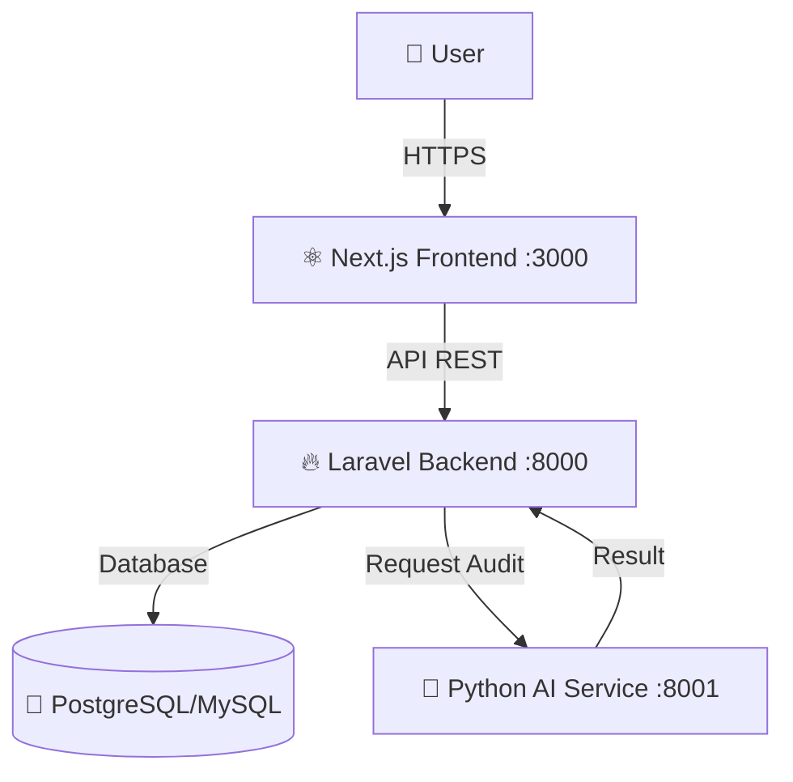

<div align="center">

  <h1>🛡️ ESCROWY</h1>
  <h3>The Next-Gen Freelance Escrow Platform</h3>
  
  <p>
    <b>Secure. Smart. Seamless.</b><br>
    Platform Rekening Bersama (Rekber) Modern dengan Audit AI Terintegrasi.
  </p>

  <p>
    <a href="#-fitur-unggulan">Fitur</a> •
    <a href="#-teknologi">Teknologi</a> •
    <a href="#-instalasi">Instalasi</a> •
    <a href="#-struktur-project">Struktur</a>
  </p>

  <p>
    
    
    
    
  </p>
</div>

---

## ⚡ Kilasan Project (Overview)

**Escrowy** bukan sekadar rekening bersama biasa. Ini adalah **Platform Kepercayaan** yang dibangun untuk generasi digital. Kami menggabungkan keamanan finansial dengan kecerdasan buatan untuk memastikan setiap transaksi berjalan adil.

> "Jangan biarkan kode buruk dibayar, dan jangan biarkan kerja keras tidak dihargai."

---

## � Fitur Unggulan

| Fitur | Deskripsi | Teknologi |
| :--- | :--- | :--- |
| **🔐 Smart Escrow** | Dana dikunci aman di sistem hingga milestone tercapai. Anti-kabur! | `DB Transactions` |
| **🤖 AI Code Auditor** | Assistant AI (Python) otomatis mengecek kualitas & keamanan kode freelancer. | `FastAPI` + `Regex` |
| **💸 Milestone Payouts** | Pembayaran bertahap (DP, Progress, Final) yang transparan. | `Midtrans` (Simulated) |
| **🎨 Violet Glass UI** | Tampilan *Cyber-aesthetic* dengan efek *Glassmorphism* & *Neon Glow*. | `Shadcn UI` + `Framer Motion` |
| **🛡️ Role-Based Access** | Dashboard khusus untuk **Klien** (Penyewa) dan **Freelancer** (Pekerja). | `Laravel Sanctum` |

---

## 🛠️ Arsitektur & Teknologi

Kami menggunakan pendekatan **Microservices** agar performa maksimal dan mudah dikembangkan.



### 📦 Tech Stack Detail

*   **Frontend (The Face):**
    *   Next.js 15 (App Router)
    *   TypeScript (Strict Mode)
    *   Tailwind CSS v4 (Oklch Colors)
    *   Framer Motion (Smooth Animations)
    *   Lucide React (Icons)

*   **Backend (The Brain):**
    *   Laravel 12 (PHP 8.2+)
    *   Sanctum (Authentication)
    *   Repository Pattern (Clean Code)

*   **AI Service (The Auditor):**
    *   FastAPI (Asynchronous Python)
    *   Pydantic (Validation)

---

## � Instalasi & Cara Jalankan

Siapkan kopi ☕, kita akan menyalakan mesin roket ini dalam 3 langkah!

### 1️⃣ Nyalakan Backend (Laravel)
Terminal 1:
```bash
cd backend-api
composer install
cp .env.example .env
php artisan key:generate
php artisan migrate
php artisan serve
# 🟢 Berjalan di: http://localhost:8000
```

### 2️⃣ Nyalakan Frontend (Next.js)
Terminal 2:
```bash
cd frontend
npm install
npm run dev
# 🔵 Berjalan di: http://localhost:3000
```

### 3️⃣ Nyalakan AI Service (Python)
Terminal 3:
```bash
cd python-service
# (Opsional) python -m venv venv && source venv/bin/activate
pip install -r requirements.txt
python src/main.py
# 🟡 Berjalan di: http://localhost:8001
```

---

## 📂 Struktur Project

```bash
📦 Escrowy
 ┣ 📂 backend-api    # 🔥 LARAVEL (API Utama & Logika Bisnis)
 ┃ ┣ 📂 app
 ┃ ┃ ┣ 📂 Services   (EscrowLogic, AiService)
 ┃ ┃ ┗ 📂 Models     (Project, Milestone, Transaction)
 ┃ ┗ 📜 routes/api.php
 ┃
 ┣ 📂 frontend       # ⚛️ NEXT.JS (Tampilan Web Keren)
 ┃ ┣ 📂 src
 ┃ ┃ ┣ 📂 app        (Dashboard, Login, Landing Page)
 ┃ ┃ ┣ 📂 components (Shared UI, ProjectCard, Sidebar)
 ┃ ┃ ┗ 📂 store      (Zustand State Management)
 ┃
 ┗ 📂 python-service # 🐍 PYTHON (AI Code Scanner)
   ┣ 📂 src
   ┃ ┗ 📜 scanner.py (Logika Audit Kode)
   ┗ 📜 main.py
```

---

<div align="center">
  <p>Dibuat dengan ❤️ dan ☕ oleh Hafisch</p>
  <p>
    
    
  </p>
</div>
